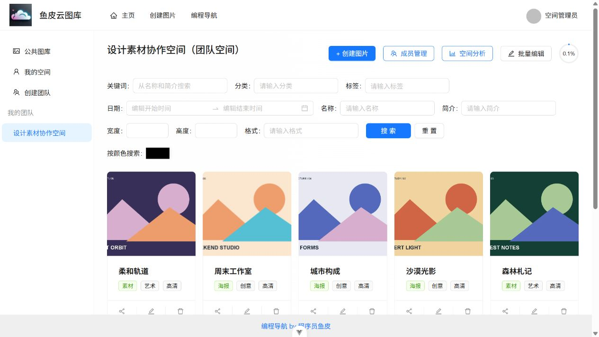
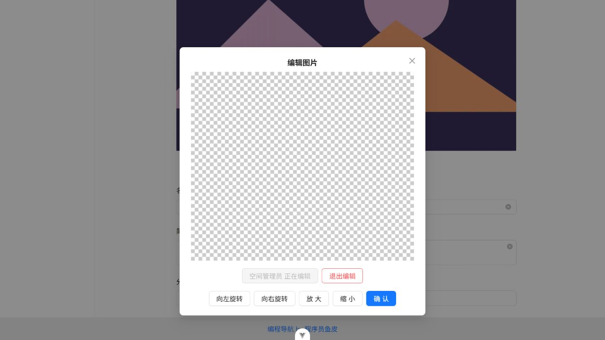
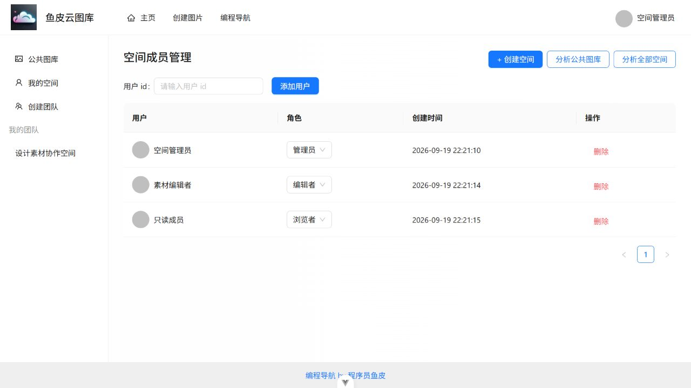

# 图库管理与协作平台

面向个人素材整理与小型团队协作的图片工作台：上传图片，按分类和标签检索，管理私人或团队空间，再进行裁剪编辑和用量分析。前端采用 Vue 3 + TypeScript + Ant Design Vue，后端采用 Spring Boot + MyBatis-Plus；通过腾讯云 COS / 数据万象存储和处理图片，使用 WebSocket 同步团队编辑动作。

[使用与配置说明](docs/quickstart.md) · [架构与实现](docs/architecture.md) · [界面与演示](docs/demo.md) · [发布清理说明](docs/publish-sanitization.md)

> 此源码副本不附带运行账号、数据库数据、密码或云服务密钥。使用者需要自行准备 MySQL、Redis，注册腾讯云账号并配置 COS 私有桶及数据万象。仓库保留配置模板与实现代码，具体环境配置、功能调试和部署由使用者完成。

## 核心功能

- **账号与会话**：注册、登录、服务端退出登录，使用 Redis 保存会话；根据登录状态和资源权限控制访问。
- **图片管理**：支持文件与 URL 上传，按关键词、分类和标签检索，在空间内按主色查找相似图片；提供详情预览、下载和公开图片审核。
- **私人空间**：集中管理个人图片，查看已用容量与图片数量，按空间配额限制上传。
- **团队空间**：添加与管理成员，区分管理员、编辑者和浏览者，按角色开放图片查看、上传、编辑与删除操作。
- **图片编辑与协作**：在浏览器内裁剪、旋转和缩放；团队编辑时由一个连接持有编辑权，通过 WebSocket 向其他连接同步旋转和缩放动作。
- **空间分析**：空间创建者与平台管理员可查看存储用量、分类、标签、文件大小分布和上传趋势，辅助整理素材。

## 技术栈与处理过程

| 层次 | 技术 | 当前用途 |
| --- | --- | --- |
| 前端 | Vue 3、TypeScript、Vite、Ant Design Vue、Pinia | 页面交互、路由、登录状态与图片工作台 |
| 后端 | Java 17、Spring Boot 2.7、MyBatis-Plus、MySQL 8 | 用户、图片、空间和成员数据，事务与配额管理 |
| 认证与会话 | Spring Session、Redis、Sa-Token | 保存登录态，校验空间角色与操作权限 |
| 图片存储与处理 | 腾讯云 COS、数据万象 | 存储图片、提取元信息和主色、转换格式与生成缩略图，通过短期签名访问私有对象 |
| 编辑与协作 | vue-cropper、WebSocket、Disruptor | 浏览器图片编辑、编辑权管理与操作事件转发 |
| 数据可视化 | ECharts、vue-echarts | 展示空间容量与图片统计数据 |

常用操作流程为：注册登录 → 创建或进入空间 → 上传图片 → 检索、预览与编辑 → 查看空间用量。公共图库另有审核流程，私人和团队空间的图片按各自权限访问。

上传时，后端校验登录态、空间权限和图片内容，将文件保存到 COS，再记录图片元数据与空间用量。MySQL 保存业务记录，图片文件由 COS 保存；浏览器取得后端授权的短期签名链接后读取图片，默认有效期为 15 分钟。

文件与 URL 上传共用后端校验逻辑，支持 JPEG、PNG 和静态 WebP。上传文件应小于 2 MiB，像素总数不超过 2500 万；URL 上传还会限制目标地址、下载大小与超时。权限判断、上传流程和存储一致性的实现见 [架构说明](docs/architecture.md)。

## 界面预览

以下截图展示本地开发环境中的团队图库、图片编辑与成员管理，使用演示账号和几何素材。



| 图片裁剪与协作 | 团队成员管理 |
| --- | --- |
|  |  |

页面操作与演示步骤见 [演示说明](docs/demo.md)。

## 本地配置与启动

准备 JDK 17、Maven 3.9、Node.js 22.14 或更新的 22 LTS、MySQL 8 和 Redis，并将 Java、Maven、Node.js 加入 PATH。图片上传与处理需要使用自己的 COS 和数据万象配置。

1. 创建专用数据库，在该库执行 [schema.sql](yu-picture-backend/sql/schema.sql)，初始化表结构。
2. 将后端目录中的 [application-local.example.yml](yu-picture-backend/application-local.example.yml) 复制为同目录的 `application-local.yml`，填入自己的数据库、Redis、COS 桶和密钥配置。
3. 将 COS 桶设为私有读，并配置允许本地前端访问的 CORS；图片处理需要相应的数据万象能力。具体配置见 [启动说明](docs/quickstart.md) 与 [部署说明](docs/deployment.md)。

本地配置放在后端 `pom.xml` 旁边，已由 Git 忽略。云密钥只用于后端，不应写入前端代码或 `VITE_` 环境变量。

在项目根目录打开终端，启动后端：

```shell
cd yu-picture-backend
mvn spring-boot:run
```

另开终端，从项目根目录安装并启动前端：

```shell
cd yu-picture-frontend
npm ci
npm run dev
```

打开 [本地工作台](http://localhost:5173)，通过注册页面创建自己的账号，再创建私人或团队空间。项目没有预置登录账号或密码。

| 服务 | 默认地址 |
| --- | --- |
| 前端 | `http://localhost:5173` |
| 后端 API | `http://localhost:8123/api` |
| 健康检查 | `http://localhost:8123/api/health` |
| MySQL | `127.0.0.1:3306` |
| Redis | `127.0.0.1:6379` |

前端开发服务器通过 `/api` 代理 HTTP 与 WebSocket 请求。服务地址与端口可按自己的环境调整；更换后端端口时，需要同步修改前端代理目标。

## 目录与实现范围

- `yu-picture-backend/`：Spring Boot 后端、配置示例、建表 SQL 与回归测试。
- `yu-picture-frontend/`：Vue 页面、API 调用、图片编辑器与前端测试。
- `docs/`：使用说明、架构设计、演示、部署与历史验证记录。
- `scripts/`：本地 HTTP 和 COS 冒烟验证脚本。
- `.github/workflows/`：前后端自动检查配置。

空间权限以数据库中的成员关系为依据；图片替换按文件大小差额更新配额，并保留原上传者。密码使用带随机盐的哈希存储，私有图片由后端鉴权后签名访问。阿里云 AI 扩图和 VIP 兑换当前未启用。

协作编辑目前适用于单后端实例，编辑权保存在进程内；图片签名过期后需重新获取链接，云端对象删除失败尚无持久重试队列。依赖版本、部署要求与其他已知限制见 [验证记录](docs/verification.md)。

## 历史验证记录

2026-09-19 的开发环境曾完成后端 151 项回归测试、5 项真实服务集成测试、前端 16 项测试，以及构建、COS 和 WebSocket 联调。这些是历史结果，不代表当前发布副本或新环境已完成相同验证。

2026-10-09 的发布清理以凭据、私人数据、历史链接和敏感响应检查为主；清理后的源码未重新执行完整构建与运行验证。检查范围见 [发布清理说明](docs/publish-sanitization.md)，复验命令与历史结果见 [验证记录](docs/verification.md)。

更多内容见 [文档索引](docs/README.md)、[开发规范](CONTRIBUTING.md) 与 [上游项目说明](docs/upstream-readme.md)。
