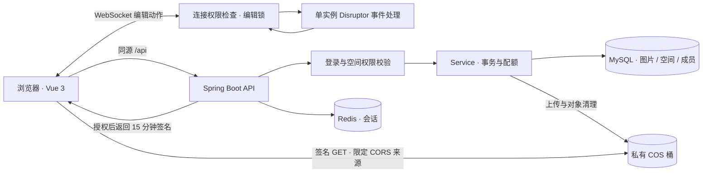

# 智能协同云图库

面向个人素材整理和小型团队协作的图片管理应用，将图片上传、分类检索、空间权限和在线裁剪集中到一个工作台。采用 Vue 3 + Spring Boot，图片保存在私有 COS 桶中，经后端鉴权后通过短期签名访问。

本仓库提供学习与二次开发源码，不附带可用账号、密钥、云资源或完整运行环境。使用者需自行注册腾讯云账号、创建 COS 桶并按需开通数据万象，填写自己的数据库、Redis 和云服务配置，再完成调试与部署。

[快速启动](docs/quickstart.md) · [架构与设计](docs/architecture.md) · [演示说明](docs/demo.md) · [验证记录](docs/verification.md) · [发布脱敏说明](docs/publish-sanitization.md)

## 核心功能

- **素材管理**：文件 / URL 上传，分类、标签、颜色检索，详情预览、下载和审核。
- **个人与团队空间**：按空间隔离图片，管理员 / 编辑者 / 浏览者三级角色，容量和数量限额。
- **图片编辑与协作**：浏览器裁剪、旋转和缩放，WebSocket 同步编辑动作，同一时刻由一个连接持有编辑权。
- **空间分析**：查看存储用量、分类、标签及图片尺寸分布。

## 效果展示

以下为本地运行的真实页面，使用临时账号和自行生成的几何素材；不是在线服务链接，不包含真实业务图片。


| 在线裁剪与协作入口 | 团队成员与角色 |
| --- | --- |
|  |  |

更多操作步骤见 [演示说明](docs/demo.md)。当前提供本地演示，尚未部署公网 Demo。

## 技术栈与架构

| 层次 | 核心技术 | 用途 |
| --- | --- | --- |
| 前端 | Vue 3、TypeScript、Vite、Ant Design Vue、Pinia | 页面交互、路由、登录状态和编辑器 |
| 后端 | Java 17、Spring Boot 2.7.6、MyBatis-Plus 3.5.9 | REST API、事务与数据访问 |
| 认证与会话 | Sa-Token、Spring Session、Redis | 空间权限判断、登录态保存 |
| 数据与文件 | MySQL 8、腾讯云 COS / 数据万象 | 业务元数据、原图及处理后的图片 |
| 实时与图表 | WebSocket、Disruptor、ECharts | 编辑动作转发、空间统计 |
| 验证 | JUnit / Mockito、Node Test Runner、ESLint、vue-tsc、GitHub Actions | 回归测试、类型与构建检查 |



浏览器从后端取得元数据与临时链接，再直接读取 COS 图片。Redis 会话共享与实时编辑锁是两种状态：当前编辑锁保存在进程内，协作部署要求单后端实例。

## 本版本的工程改进

| 问题 | 实现方式 | 证据入口 |
| --- | --- | --- |
| 请求体伪造角色、跨空间读取 | 以数据库成员关系作为权限依据，统一详情、列表和缓存入口的访问检查 | [权限报告](docs/auth-work-report.md) |
| 并发替换导致数量 / 容量错误 | 条件更新配额、事务锁与替换差额，保留原上传者 | [存储报告](docs/storage-work-report.md) |
| 私有图片裸链接可访问 | 私有 COS、返回值复制后签名、数据库保留规范地址 | [签名报告](docs/cos-access-work-report.md) |
| 多连接争用编辑权、动作回传 | 按连接持有编辑权，断线释放，动作重新鉴权且不回传发送者 | [协作报告](docs/websocket-work-report.md) |
| 密码和配置管理 | PBKDF2 随机盐、旧密码登录迁移、外置本地配置 | [密码报告](docs/password-work-report.md) |

这些是当前维护版本的实现记录；个人项目介绍应按自己实际参与、理解和验证的范围表达。代码阅读与讲解练习见 [项目讲解提纲](docs/interview-guide.md)。

## 仓库结构与启动

```text
.
├── yu-picture-backend/       # 当前普通后端；sql/schema.sql 为新库结构
├── yu-picture-frontend/      # Vue 页面、API 调用与前端回归测试
├── docs/                    # 启动、架构、演示、部署及验证说明
├── scripts/                 # 本地 HTTP / COS 冒烟验证
└── .github/workflows/ci.yml  # 普通前后端的独立验证任务
```

准备 JDK 17、Maven 3.9.x、Node.js 22.14+、MySQL 8 和 Redis；在**新数据库**执行 `yu-picture-backend/sql/schema.sql`，将后端 `application-local.example.yml` 复制为 `application-local.yml` 并填写本地配置。

```shell
# 终端一：在 yu-picture-backend 内
mvn spring-boot:run

# 终端二：在 yu-picture-frontend 内
npm ci
npm run dev
```

访问 [本地页面](http://localhost:5173)，注册账号后创建空间。COS 权限、完整配置与常见问题见 [快速启动](docs/quickstart.md)。本地配置、密码和云密钥不提交 Git。

## 验证与适用边界

```shell
# 后端目录；默认无需真实数据库、Redis 或 COS 密钥
mvn clean verify

# 前端目录
npm test
npm run lint
npm run build
```

2026-09-19 的历史验证记录包括：后端 151 项回归测试、5 项真实服务集成测试、前端 16 项测试，以及真实 COS 和 WebSocket 联调。这些结果不代表 2026-10-09 发布脱敏时重新运行了全部测试或连接了云服务。范围和命令以 [验证记录](docs/verification.md) 为准；没有宣称压测成绩或生产可用性。

本版本不启用阿里云 AI 扩图、VIP 兑换、默认密码新增用户和分库分表实验；DDD 仅供参考。已知限制包括单实例协作、签名到期需刷新、对象清理尚无持久重试队列及部分依赖告警，详见验证记录。

DDD 参考目录仅留在开发副本中，不包含在发布副本，也不参与当前构建或 CI。

## 文档与维护

[文档索引](docs/README.md) · [开发规范](CONTRIBUTING.md) · [部署说明](docs/deployment.md) · [安全说明](SECURITY.md)

本目录用于准备 GitHub 发布，真实账号、密码和云配置应保存在被忽略的本地文件或环境变量中。发布副本的清理范围见 [发布脱敏说明](docs/publish-sanitization.md)，历史隔离原则见 [发布记录](docs/private-publication.md)。GitHub Desktop 导入本地仓库不等于已上传；提交前仍需核对实际暂存文件和目标远程。

## 来源

基于 [程序员鱼皮 / yu-picture](https://github.com/liyupi/yu-picture) 学习与维护，保留原始署名和 [上游说明](docs/upstream-readme.md)。本仓库没有新增开源许可证；对外分发前应核对上游授权。
