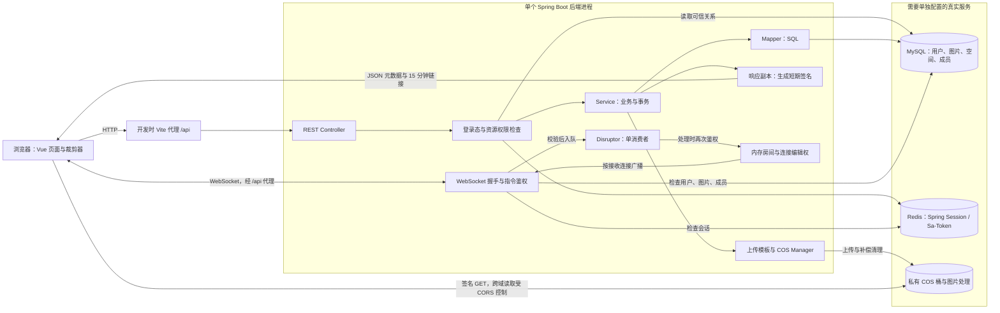

# 架构与设计

本版本采用前后端分离的单体架构：Vue 负责交互，Spring Boot 负责业务与权限，MySQL 保存业务记录，Redis 保存会话，腾讯云 COS 保存图片。当前维护对象是普通后端与前端，DDD 参考代码仅留在开发副本，不随发布副本提供。

这是基于[上游项目](upstream-readme.md)的学习与维护版本。原有图库、空间、上传模板和协作框架来自上游；权限、存储一致性、密码、访问签名及协作生命周期的维护记录见[验证记录](verification.md)。

## 从 SSM 理解代码分层

已有 Spring、Spring MVC、MyBatis 基础，可以从下面的对应关系开始。Spring Boot 简化了配置与启动；业务仍通过 Controller → Service → Mapper 组织，没有拆成微服务。

| 位置 | 职责 | 代表入口 |
| --- | --- | --- |
| `controller` | HTTP 参数、入口鉴权、统一响应 | [PictureController](../yu-picture-backend/src/main/java/com/yupi/yupicturebackend/controller/PictureController.java) |
| `service/impl` | 图片业务、事务、配额、权限约束 | [PictureServiceImpl](../yu-picture-backend/src/main/java/com/yupi/yupicturebackend/service/impl/PictureServiceImpl.java) |
| `mapper` | MyBatis-Plus CRUD 与关键 SQL | [SpaceMapper](../yu-picture-backend/src/main/java/com/yupi/yupicturebackend/mapper/SpaceMapper.java) |
| `manager` | 上传、COS、权限、WebSocket 等能力 | [上传模板](../yu-picture-backend/src/main/java/com/yupi/yupicturebackend/manager/upload/PictureUploadTemplate.java) |
| `model` | Entity 对应存储，DTO 接收参数，VO 面向返回 | [PictureVO](../yu-picture-backend/src/main/java/com/yupi/yupicturebackend/model/vo/PictureVO.java) |
| 前端 `pages` / `components` | 页面与可复用交互 | [图片详情](../yu-picture-frontend/src/pages/PictureDetailPage.vue)、[裁剪器](../yu-picture-frontend/src/components/ImageCropper.vue) |
| 前端 `api` / `stores` / `utils` | API 调用、登录状态、路由和连接工具 | [请求封装](../yu-picture-frontend/src/request.ts)、[登录状态](../yu-picture-frontend/src/stores/useLoginUserStore.ts) |

后端版本以 [pom.xml](../yu-picture-backend/pom.xml) 为准：Java 17、Spring Boot 2.7.6、MyBatis-Plus 3.5.9、Sa-Token 1.39.0、Disruptor 3.4.2。前端 [package.json](../yu-picture-frontend/package.json) 声明 Vue `^3.5.13`、TypeScript `~5.6.3`、Vite `^6.0.1`、Ant Design Vue `^4.2.6`；实际安装版本由锁文件确定。Spring Boot 2.7 是旧框架线，当前未进行跨大版本升级。

## 请求和数据流

开发代理配置见 [vite.config.ts](../yu-picture-frontend/vite.config.ts)，后端默认监听 8123。生产环境需要另行配置 HTTPS、反向代理和 WebSocket 升级转发，不能直接把 Vite 开发服务器当成正式部署方案。配置步骤见[部署说明](deployment.md)。

后端返回图片信息与短期链接，浏览器再直接向 COS 读取图片。MySQL 事务只约束数据库操作，不能回滚已经上传到 COS 的对象。

## 数据模型与权限

新库结构见 [schema.sql](../yu-picture-backend/sql/schema.sql)。表之间的关联通过业务字段和应用代码维护，当前建表脚本没有定义外键。

| 表 | 关键关系与用途 |
| --- | --- |
| `user` | 登录账号、密码摘要、站点角色；账号唯一 |
| `space` | 创建者、私人/团队类型、容量和数量上限及已用量 |
| `picture` | 上传者、图片地址、分类标签、审核状态；`spaceId` 为空表示公共图库 |
| `space_user` | 团队成员及角色；`spaceId + userId` 唯一 |

站点管理员角色和团队空间角色是不同概念。团队成员的管理员、编辑者、浏览者权限来自数据库成员记录和角色配置；私人空间按拥有者/站点管理员判断；公共图片按审核状态和拥有者/管理员身份检查。不能从请求体里的 `userRole` 或嵌套对象推导权限。

[StpInterfaceImpl](../yu-picture-backend/src/main/java/com/yupi/yupicturebackend/manager/auth/StpInterfaceImpl.java) 只提取资源 ID，再读取数据库关系，并校验 Spring Session 与 Sa-Token 身份一致。[SpaceUserAuthManager](../yu-picture-backend/src/main/java/com/yupi/yupicturebackend/manager/auth/SpaceUserAuthManager.java) 将可信空间角色转换成操作权限。前端按钮显隐提供交互提示，后端检查才是安全边界。

图片详情和分页入口也执行访问检查。历史 `/picture/list/page/vo/cache` 路由保留兼容，但当前直接调用有鉴权的分页逻辑，不使用共享图片结果缓存；依赖中仍有 Caffeine，不能据此宣称已启用多级缓存加速。

## 上传、替换和删除

文件和 URL 上传共用模板：检查输入 → 有上限地写入临时文件 → 校验图片内容 → 上传 COS 并取得处理结果 → 保存元数据 → 清理临时文件。JPEG/PNG 进行本地解码；静态 WebP 进行容器与尺寸检查，完整解码结果仍由 COS 确认。限制为 2 MiB、2500 万像素，拒绝动画 WebP、GIF 和 SVG。

[UrlPictureUpload](../yu-picture-backend/src/main/java/com/yupi/yupicturebackend/manager/upload/UrlPictureUpload.java) 仅接受受限的公网 HTTP(S) 地址，检查连接实际使用的 DNS 结果，禁止重定向，限制超时和下载字节数。这些检查降低 SSRF 风险，部署时仍应限制后端网络出口。

图片替换在事务内通过 [PictureMapper](../yu-picture-backend/src/main/java/com/yupi/yupicturebackend/mapper/PictureMapper.java) 的 `SELECT ... FOR UPDATE` 读取当前记录，再计算容量差额；数量差额为 0，并保留原上传者。`SpaceMapper.adjustUsage` 用带条件的原子 SQL 调整额度，额度更新与图片记录写入处于同一事务。删除使用实际存储的大小扣减用量；公共图片没有空间额度操作。

新对象上传后，数据库事务若回滚，尝试清理新对象；替换或删除成功提交后，再尝试清理旧对象。清理前检查是否仍有图片引用相同地址。当前补偿清理没有持久重试队列，进程崩溃或云端删除失败可能留下孤立对象，应根据日志核对和重试。

## 私有图片访问

数据库保存不含签名的规范 COS 地址。[PictureUrlResponseAdvice](../yu-picture-backend/src/main/java/com/yupi/yupicturebackend/config/PictureUrlResponseAdvice.java) 在输出阶段复制图片、列表或分页内容，再由 [PictureUrlSigner](../yu-picture-backend/src/main/java/com/yupi/yupicturebackend/manager/PictureUrlSigner.java) 为可信 COS 来源生成 15 分钟 GET 签名，不改写数据库对象。

响应签名不代替接口鉴权，COS CORS 也不代替桶权限。签名链接在有效期内是持有者凭证，即使成员权限随后被撤销，已经发出的链接仍可能有效。页面长时间停留需要重新获取数据；当前没有自动续签机制。

## 协作与前后端契约

[WsHandshakeInterceptor](../yu-picture-backend/src/main/java/com/yupi/yupicturebackend/manager/websocket/WsHandshakeInterceptor.java) 仅允许具有编辑权限的已登录用户进入团队图片协作。[PictureEditHandler](../yu-picture-backend/src/main/java/com/yupi/yupicturebackend/manager/websocket/PictureEditHandler.java) 在收到消息和消费指令时重新检查权限，并按图片维护房间。

编辑权归属于 WebSocket 连接。同一账号的两个标签页也是两个连接，不能互相代领或释放编辑权。每个接收连接得到自己的 `isEditor`；编辑动作不回传发送连接，避免前端重复执行。断线或传输失败释放拥有的编辑权，新加入的连接收到当前状态。

房间和编辑权保存在 `ConcurrentHashMap` 中，Disruptor 当前只有一个消费者。Redis 会话共享不等于协作状态共享；多后端实例的锁与广播尚未实现，慢连接或慢查询也可能拖延其他房间。完全空闲连接不会因为成员被移除就立即主动断开，后续相关活动会重新检查权限。

保存裁剪结果仍通过普通 HTTP 上传/替换链路；WebSocket 转发的是编辑动作，并不持久化最终图片，也不是 CRDT/OT 多人同时自由编辑。前端连接实现见 [pictureEditWebSocket.ts](../yu-picture-frontend/src/utils/pictureEditWebSocket.ts)。

Java `Long` ID 在 JSON 中按字符串输出，前端路由通过 [routeId](../yu-picture-frontend/src/utils/route.ts) 保留原始十进制字符串，避免经过 JavaScript `Number` 后丢失精度。

## 验证范围

默认后端回归测试和前端检查可在不连接真实服务时执行；启动完整应用、验证数据库竞争、Redis 会话与 COS 访问需要真实服务。当前的执行日期、测试数量与手工验证范围统一记录在[验证记录](verification.md)，不将构建通过、单机联调或引入 Disruptor 等同于生产可用和性能压测通过。

阿里云 AI 扩图、VIP 兑换、默认密码新增用户和分库分表实验不启用。DDD 目录不参与本版本运行、测试与 CI。继续阅读[项目讲解提纲](interview-guide.md)或[开发规范](../CONTRIBUTING.md)。
